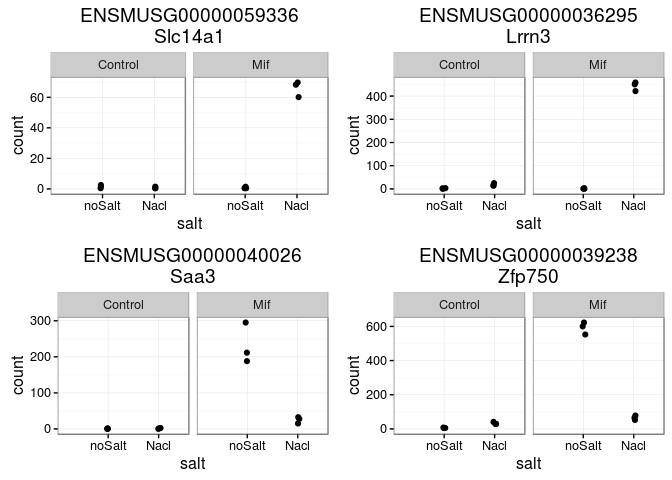
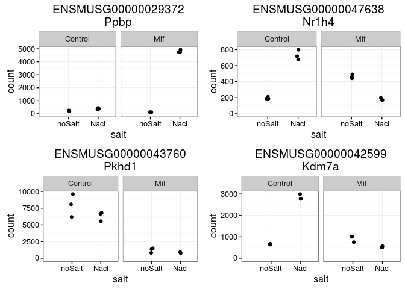
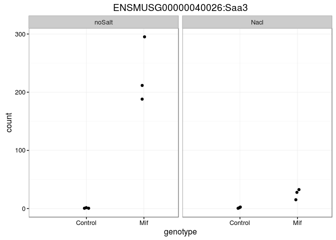
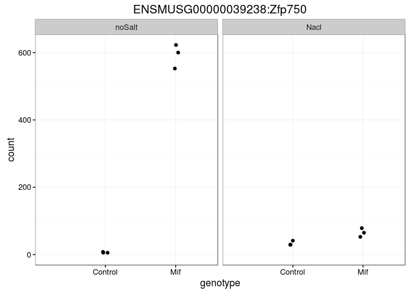

Load Libraries
--------------

    library(Rsamtools)
    library(GenomicAlignments)
    library(BiocParallel)
    library(DESeq2)
    library(ggplot2)
    library(magrittr)
    library(biomaRt)

    ts<-format(Sys.time(), "%a_%b_%d_%Y_%H%M")
    cbPalette <- c("#999999", "#E69F00", "#56B4E9", "#009E73", "#F0E442", "#0072B2", "#D55E00", "#CC79A7")

Get annotation data from biomaRt
--------------------------------

    ensembl_84<-useMart(biomart="ENSEMBL_MART_ENSEMBL",host = "useast.ensembl.org", dataset="mmusculus_gene_ensembl")
    txdb84<-makeTxDbFromBiomart(biomart="ENSEMBL_MART_ENSEMBL",host = "www.ensembl.org",dataset="mmusculus_gene_ensembl")
    ens84<-exonsBy(txdb84,by="gene")
    mgi <-  getBM(attributes = c("ensembl_gene_id", "mgi_id", "mgi_symbol"), filters = "ensembl_gene_id",
        values = names(ens84), mart = ensembl_84)
    save(ens84,file="ens84_mouse.rdata")
    save(mgi,file="mgi.rdata")

EDA
---

    load("igarash0_Project_004_genehits_ens84Thu_Jun_30_2016_2351.rdata")
    load("mgi.rdata")
    cds <- DESeqDataSet(genehits,design=~1)
    cds$filename<-rownames(colData(cds))
    colData(cds)$genotype<-as.factor(sapply(strsplit(rownames(colData(cds)),"-"),function(x){x[1]}))
    colData(cds)$salt<-factor(ifelse(sapply(strsplit(rownames(colData(cds)),"-"),function(x){x[2]})=="Nacl","Nacl","noSalt"),levels=c("noSalt","Nacl"))
    plotPCA(DESeqTransform(cds),intgroup=c("salt","genotype"))+
      scale_color_manual(values=cbPalette)  + theme_bw()

    design(cds)<- ~ genotype + salt + genotype:salt
    cds <- DESeq(cds)

    ## estimating size factors

    ## estimating dispersions

    ## gene-wise dispersion estimates

    ## mean-dispersion relationship

    ## final dispersion estimates

    ## fitting model and testing

    plotCounts(cds,"ENSMUSG00000020679",intgroup=c("salt","genotype"),returnData=F)

    gg_plotCounts<-function(x="ENSMUSG00000020679") {
      if (substr(x,1,7)=="ENSMUSG") {
      title<-mgi[grep(x,mgi$ensembl_gene_id),"mgi_symbol"]
      } else {
        title<-x
        x<-mgi[grep(paste0("^",title,"$"),mgi$mgi_symbol),"ensembl_gene_id"]
      }
      
    plotCounts(cds,x,intgroup=c("salt","genotype"),returnData=T) %>% 
      ggplot(aes(x=genotype, y=count)) +
      geom_point(position=position_jitter(w=0.1,h=0)) + ggtitle(paste0(x,":",title)) +
     # scale_y_log10(breaks=c(25,100,400)) + 
     # scale_y_continuous(trans="log2") + ylim(0,25000) +
      expand_limits(x=0, y = 0) +
      facet_grid(~salt) + theme_bw()
      }

    gg_plotCounts("Hnf1b")

Look for genes with High Interaction Term
-----------------------------------------

    resultsNames(cds)

    ## [1] "Intercept"               "genotype_Mif_vs_Control"
    ## [3] "salt_Nacl_vs_noSalt"     "genotypeMif.saltNacl"

    res<-results(cds, name="genotypeMif.saltNacl")
    summary(res)

    ## 
    ## out of 32627 with nonzero total read count
    ## adjusted p-value < 0.1
    ## LFC > 0 (up)     : 2643, 8.1% 
    ## LFC < 0 (down)   : 3279, 10% 
    ## outliers [1]     : 0, 0% 
    ## low counts [2]   : 13570, 42% 
    ## (mean count < 5)
    ## [1] see 'cooksCutoff' argument of ?results
    ## [2] see 'independentFiltering' argument of ?results

    resDF<-as.data.frame(res)
    resDF<-resDF[!is.na(resDF$padj),]
    resDF<-resDF[with(resDF,order(-log2FoldChange)),]
    idx<-match(rownames(resDF),mgi$ensembl_gene_id)
    resDF$mgi<-mgi[idx,"mgi_symbol"]
    head(resDF)

    ##                      baseMean log2FoldChange    lfcSE     stat
    ## ENSMUSG00000059336  16.803167       9.041953 1.908058 4.738826
    ## ENSMUSG00000109517   8.245258       6.036978 1.708038 3.534453
    ## ENSMUSG00000071047   6.705180       5.274840 2.148888 2.454683
    ## ENSMUSG00000021799   6.340113       5.229401 2.069298 2.527137
    ## ENSMUSG00000031101  10.311104       5.103819 1.573051 3.244535
    ## ENSMUSG00000036295 115.987316       5.017252 1.004011 4.997210
    ##                          pvalue         padj     mgi
    ## ENSMUSG00000059336 2.149603e-06 2.907381e-05 Slc14a1
    ## ENSMUSG00000109517 4.086203e-04 2.865003e-03        
    ## ENSMUSG00000071047 1.410088e-02 5.428697e-02   Ces1a
    ## ENSMUSG00000021799 1.149966e-02 4.631211e-02    Opn4
    ## ENSMUSG00000031101 1.176425e-03 7.032351e-03   Sash3
    ## ENSMUSG00000036295 5.816560e-07 8.917633e-06   Lrrn3

    gg_plotCounts("Slc14a1")

    gg_plotCounts("Lrrn3")

    tail(resDF)

    ##                      baseMean log2FoldChange     lfcSE       stat
    ## ENSMUSG00000040026  64.302005      -4.715037 1.4969759  -3.149708
    ## ENSMUSG00000053063   7.365622      -4.728817 1.9185122  -2.464836
    ## ENSMUSG00000050808   7.643249      -4.896977 1.9660591  -2.490758
    ## ENSMUSG00000046049   6.069607      -5.619324 1.7556885  -3.200639
    ## ENSMUSG00000039238 173.853233      -5.635198 0.4196894 -13.427068
    ## ENSMUSG00000028280   6.456827      -5.900826 1.5244094  -3.870893
    ##                          pvalue         padj     mgi
    ## ENSMUSG00000040026 1.634338e-03 9.280567e-03    Saa3
    ## ENSMUSG00000053063 1.370762e-02 5.319202e-02 Clec12a
    ## ENSMUSG00000050808 1.274709e-02 5.025266e-02   Muc15
    ## ENSMUSG00000046049 1.371234e-03 7.993764e-03   Rp1l1
    ## ENSMUSG00000039238 4.197029e-41 1.142611e-38  Zfp750
    ## ENSMUSG00000028280 1.084372e-04 9.111502e-04  Gabrr1

    gg_plotCounts("Saa3")

    gg_plotCounts("Zfp750")

    resDF<-resDF[with(resDF,order(padj)),]
    head(resDF)

    ##                    baseMean log2FoldChange      lfcSE      stat
    ## ENSMUSG00000029372 1387.467       4.606230 0.15845529  29.06959
    ## ENSMUSG00000031538 9789.763      -1.831422 0.06306890 -29.03843
    ## ENSMUSG00000040998 8210.628      -2.267864 0.08705569 -26.05072
    ## ENSMUSG00000029722 4025.367       1.500072 0.06098025  24.59931
    ## ENSMUSG00000002365 8026.159      -1.430541 0.05934718 -24.10462
    ## ENSMUSG00000021822 3029.456       1.771738 0.07366780  24.05038
    ##                           pvalue          padj   mgi
    ## ENSMUSG00000029372 8.703700e-186 1.658664e-181  Ppbp
    ## ENSMUSG00000031538 2.153975e-185 2.052415e-181  Plat
    ## ENSMUSG00000040998 1.320242e-149 8.386620e-146  Npnt
    ## ENSMUSG00000029722 1.284969e-133 6.121913e-130 Agfg2
    ## ENSMUSG00000002365 2.236009e-128 8.522323e-125  Snx9
    ## ENSMUSG00000021822 8.272104e-128 2.627358e-124  Plau

    gg_plotCounts("Ppbp")

