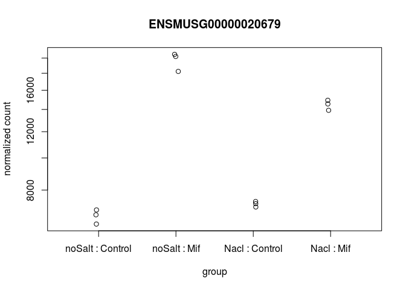
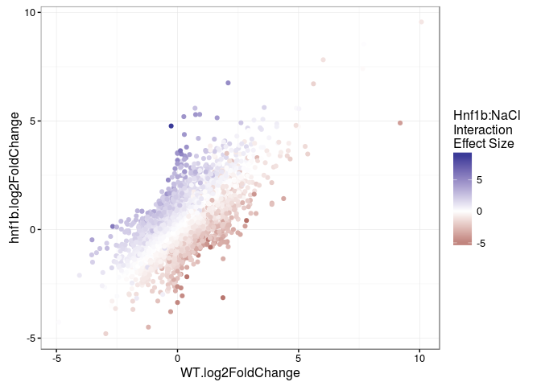

Load Libraries
--------------

    library(Rsamtools)
    library(GenomicAlignments)
    library(BiocParallel)
    library(DESeq2)
    library(ggplot2)
    library(magrittr)
    library(biomaRt)
    library(ChIPpeakAnno)
    library(Mus.musculus)
    library(goseq)
    library(ComplexHeatmap)
    library(gridExtra)

    ts<-format(Sys.time(), "%a_%b_%d_%Y_%H%M")
    cbPalette <- c("#999999", "#E69F00", "#56B4E9", "#009E73", "#F0E442", "#0072B2", "#D55E00", "#CC79A7")

Get annotation data from biomaRt
--------------------------------

    ensembl_84<-useMart(biomart="ENSEMBL_MART_ENSEMBL",host = "useast.ensembl.org", dataset="mmusculus_gene_ensembl")
    txdb84<-makeTxDbFromBiomart(biomart="ENSEMBL_MART_ENSEMBL",host = "www.ensembl.org",dataset="mmusculus_gene_ensembl")
    ens84<-exonsBy(txdb84,by="gene")
    mgi <-  getBM(attributes = c("ensembl_gene_id", "mgi_id", "mgi_symbol"), filters = "ensembl_gene_id",
        values = names(ens84), mart = ensembl_84)
    save(ens84,file="ens84_mouse.rdata")
    save(mgi,file="mgi.rdata")

    #Need TSS data for ChIP Annotation
    tss<-getAnnotation(ensembl_84,featureType="TSS")
    save(tss,file="tss.rdata")

Summarize Overlaps
------------------

Run summarizeOverlaps.Rmd on HPC cluster.

EDA
---

    load("igarash0_Project_004_genehits_ens84Thu_Jun_30_2016_2351.rdata")
    load("mgi.rdata")
    cds <- DESeqDataSet(genehits,design=~1)
    cds$filename<-rownames(colData(cds))
    colData(cds)$genotype<-as.factor(sapply(strsplit(rownames(colData(cds)),"-"),function(x){x[1]}))
    colData(cds)$salt<-factor(ifelse(sapply(strsplit(rownames(colData(cds)),"-"),function(x){x[2]})=="Nacl","Nacl","noSalt"),levels=c("noSalt","Nacl"))

    #PCA plot by Group
    plotPCA(DESeqTransform(cds),intgroup=c("salt","genotype"))+
      scale_color_manual(values=cbPalette)  + theme_bw()

    design(cds)<- ~ genotype + salt + genotype:salt
    cds <- DESeq(cds)

    ## estimating size factors

    ## estimating dispersions

    ## gene-wise dispersion estimates

    ## mean-dispersion relationship

    ## final dispersion estimates

    ## fitting model and testing

    #Plot Hnf1b Counts
    plotCounts(cds,"ENSMUSG00000020679",intgroup=c("salt","genotype"),returnData=F)

ggplot version of plotCounts to facet by genotype
-------------------------------------------------

    gg_plotCounts<-function(x="ENSMUSG00000020679") {
      if (substr(x,1,7)=="ENSMUSG") {
      title<-mgi[grep(x,mgi$ensembl_gene_id),"mgi_symbol"]
      } else {
        title<-x
        x<-mgi[grep(paste0("^",title,"$"),mgi$mgi_symbol),"ensembl_gene_id"]
      }
      
    plotCounts(cds,x,intgroup=c("salt","genotype"),returnData=T) %>% 
      ggplot(aes(x=salt, y=count)) +
      geom_point(position=position_jitter(w=0.1,h=0)) + ggtitle(paste0(x,"\n",title)) +
     # scale_y_log10(breaks=c(25,100,400)) + 
     # scale_y_continuous(trans="log2") + ylim(0,25000) +
      expand_limits(x=0, y = 0) +
      facet_grid(~genotype) + theme_bw()
      }

    gg_plotCounts("Nr1h4")

Look for genes with High Interaction Term
-----------------------------------------

    resultsNames(cds)

    ## [1] "Intercept"               "genotype_Mif_vs_Control"
    ## [3] "salt_Nacl_vs_noSalt"     "genotypeMif.saltNacl"

    res<-results(cds, name="genotypeMif.saltNacl",alpha=0.05,lfcThreshold = 1)
    summary(res)

    ## 
    ## out of 32627 with nonzero total read count
    ## adjusted p-value < 0.05
    ## LFC > 0 (up)     : 55, 0.17% 
    ## LFC < 0 (down)   : 33, 0.1% 
    ## outliers [1]     : 0, 0% 
    ## low counts [2]   : 12337, 38% 
    ## (mean count < 3)
    ## [1] see 'cooksCutoff' argument of ?results
    ## [2] see 'independentFiltering' argument of ?results

    resDF<-as.data.frame(res)
    resDF<-resDF[!is.na(resDF$padj),]
    resDF<-resDF[with(resDF,order(-log2FoldChange)),]
    idx<-match(rownames(resDF),mgi$ensembl_gene_id)
    resDF$mgi<-mgi[idx,"mgi_symbol"]
    resDF<-resDF[with(resDF,order(padj)),]
    head(resDF)

    ##                     baseMean log2FoldChange      lfcSE      stat
    ## ENSMUSG00000029372 1387.4673       4.606230 0.15845529  22.75866
    ## ENSMUSG00000047638  392.1129      -3.270643 0.15009656 -15.12788
    ## ENSMUSG00000040998 8210.6283      -2.267864 0.08705569 -14.56382
    ## ENSMUSG00000057315 2196.7925       2.446659 0.10394903  13.91700
    ## ENSMUSG00000031538 9789.7632      -1.831422 0.06306890 -13.18276
    ## ENSMUSG00000042599 1238.9454      -2.920010 0.14850818 -12.92865
    ##                           pvalue          padj      mgi
    ## ENSMUSG00000029372 1.177978e-114 2.390118e-110     Ppbp
    ## ENSMUSG00000047638  1.060578e-51  1.075956e-47    Nr1h4
    ## ENSMUSG00000040998  4.771390e-48  3.227050e-44     Npnt
    ## ENSMUSG00000057315  4.994128e-44  2.533271e-40 Arhgap24
    ## ENSMUSG00000031538  1.102831e-39  4.475287e-36     Plat
    ## ENSMUSG00000042599  3.102228e-38  1.049070e-34    Kdm7a

    resDF["ENSMUSG00000047638",]

    ##                    baseMean log2FoldChange     lfcSE      stat
    ## ENSMUSG00000047638 392.1129      -3.270643 0.1500966 -15.12788
    ##                          pvalue         padj   mgi
    ## ENSMUSG00000047638 1.060578e-51 1.075956e-47 Nr1h4

    g1<-gg_plotCounts("Slc14a1")
    g2<-gg_plotCounts("Lrrn3")
    tail(resDF)

    ##                     baseMean log2FoldChange    lfcSE      stat      pvalue
    ## ENSMUSG00000099472  4.625568      -4.614580 1.924058 -1.878624 0.060295884
    ## ENSMUSG00000040026 64.302005      -4.715037 1.496976 -2.481694 0.013075937
    ## ENSMUSG00000053063  7.365622      -4.728817 1.918512 -1.943598 0.051943913
    ## ENSMUSG00000050808  7.643249      -4.896977 1.966059 -1.982126 0.047465112
    ## ENSMUSG00000086774  3.056339      -5.047926 1.619951 -2.498796 0.012461615
    ## ENSMUSG00000046049  6.069607      -5.619324 1.755689 -2.631061 0.008511866
    ##                    padj     mgi
    ## ENSMUSG00000099472    1 Gm29539
    ## ENSMUSG00000040026    1    Saa3
    ## ENSMUSG00000053063    1 Clec12a
    ## ENSMUSG00000050808    1   Muc15
    ## ENSMUSG00000086774    1 Gm11915
    ## ENSMUSG00000046049    1   Rp1l1

    g3<-gg_plotCounts("Saa3")
    g4<-gg_plotCounts("Zfp750")
    grid.arrange(g1,g2,g3,g4,ncol=2)

    g1<-gg_plotCounts("Ppbp")
    g2<-gg_plotCounts("Nr1h4")
    g3<-gg_plotCounts("Pkhd1")
    g4<-gg_plotCounts("Kdm7a")
    grid.arrange(g1,g2,g3,g4,ncol=2)

    ## Make a list of genes that have high (logFC > 1) Interaction Terms
    length(interactive_genes<-rownames(resDF[abs(resDF$log2FoldChange) > 1 & resDF$padj < 0.05,]))

    ## [1] 88

Calculate LogFC within each Genotype
====================================

Control Cells
-------------

    cds2<-cds
    cds2$group <- factor(paste0(cds2$genotype, cds2$salt))
    design(cds2)<- ~ group
    cds2 <- DESeq(cds2) 

    ## using pre-existing size factors

    ## estimating dispersions

    ## found already estimated dispersions, replacing these

    ## gene-wise dispersion estimates

    ## mean-dispersion relationship

    ## final dispersion estimates

    ## fitting model and testing

    resultsNames(cds2)

    ## [1] "Intercept"          "groupControlNacl"   "groupControlnoSalt"
    ## [4] "groupMifNacl"       "groupMifnoSalt"

    summary(res_wt<-results(cds2, contrast=c("group","ControlNacl","ControlnoSalt"),alpha=0.05,lfcThreshold = 0))

    ## 
    ## out of 32627 with nonzero total read count
    ## adjusted p-value < 0.05
    ## LFC > 0 (up)     : 4450, 14% 
    ## LFC < 0 (down)   : 4721, 14% 
    ## outliers [1]     : 6, 0.018% 
    ## low counts [2]   : 10480, 32% 
    ## (mean count < 2)
    ## [1] see 'cooksCutoff' argument of ?results
    ## [2] see 'independentFiltering' argument of ?results

    table(ifelse(res_wt$log2FoldChange>1, "up", ifelse(res_wt$log2FoldChange< -1, "down", "no_change")))

    ## 
    ##      down no_change        up 
    ##       579     30760      1288

    res_wt<-as.data.frame(res_wt)
    colnames(res_wt)<-paste0("WT",".",colnames(res_wt))

Hnf1b DN Cells
--------------

    summary(res_hnf1b<-results(cds2, contrast=c("group","MifNacl","MifnoSalt")))

    ## 
    ## out of 32627 with nonzero total read count
    ## adjusted p-value < 0.1
    ## LFC > 0 (up)     : 5854, 18% 
    ## LFC < 0 (down)   : 5629, 17% 
    ## outliers [1]     : 6, 0.018% 
    ## low counts [2]   : 7399, 23% 
    ## (mean count < 1)
    ## [1] see 'cooksCutoff' argument of ?results
    ## [2] see 'independentFiltering' argument of ?results

    table(ifelse(res_hnf1b$log2FoldChange>1, "up", ifelse(res_hnf1b$log2FoldChange< -1, "down", "no_change")))

    ## 
    ##      down no_change        up 
    ##       657     29884      2086

    res_hnf1b<-as.data.frame(res_hnf1b)
    colnames(res_hnf1b)<-paste0("hnf1b",".",colnames(res_hnf1b))

Merge WT and Hnf1b DN Results
-----------------------------

    res_merged<-cbind(res_wt,res_hnf1b)
    head(res_merged)

    ##                     WT.baseMean WT.log2FoldChange   WT.lfcSE    WT.stat
    ## ENSMUSG00000000001 1.041893e+04        -0.2396384 0.03810011 -6.2897046
    ## ENSMUSG00000000003 8.099718e-02         0.0000000 0.18835357  0.0000000
    ## ENSMUSG00000000028 6.492142e+03         0.2311860 0.04090529  5.6517381
    ## ENSMUSG00000000031 1.217915e+01        -0.3951343 0.39967474 -0.9886398
    ## ENSMUSG00000000037 1.251645e+00         0.2407248 0.19579819  1.2294535
    ## ENSMUSG00000000049 4.969969e+00        -0.1024088 0.46509691 -0.2201882
    ##                       WT.pvalue      WT.padj hnf1b.baseMean
    ## ENSMUSG00000000001 3.180707e-10 2.668588e-09   1.041893e+04
    ## ENSMUSG00000000003 1.000000e+00           NA   8.099718e-02
    ## ENSMUSG00000000028 1.588335e-08 1.091136e-07   6.492142e+03
    ## ENSMUSG00000000031 3.228394e-01 4.707579e-01   1.217915e+01
    ## ENSMUSG00000000037 2.189018e-01           NA   1.251645e+00
    ## ENSMUSG00000000049 8.257246e-01 8.898262e-01   4.969969e+00
    ##                    hnf1b.log2FoldChange hnf1b.lfcSE hnf1b.stat
    ## ENSMUSG00000000001          -0.22311423  0.03789816 -5.8872051
    ## ENSMUSG00000000003          -0.03905830  0.18835357 -0.2073669
    ## ENSMUSG00000000028           0.38842116  0.04079782  9.5206358
    ## ENSMUSG00000000031           0.15525812  0.39671780  0.3913566
    ## ENSMUSG00000000037           0.03860877  0.19552932  0.1974577
    ## ENSMUSG00000000049           1.16381071  0.45194906  2.5750927
    ##                    hnf1b.pvalue   hnf1b.padj
    ## ENSMUSG00000000001 3.927812e-09 2.755696e-08
    ## ENSMUSG00000000003 8.357233e-01           NA
    ## ENSMUSG00000000028 1.721228e-21 2.640682e-20
    ## ENSMUSG00000000031 6.955337e-01 8.055973e-01
    ## ENSMUSG00000000037 8.434694e-01 9.025491e-01
    ## ENSMUSG00000000049 1.002132e-02 2.720751e-02

    #res_merged<-res_merged[res_merged$WT.padj < 0.05 & res_merged$WT.baseMean > 100,]
    res_merged<-subset(res_merged,!(is.na(WT.log2FoldChange) | is.na(hnf1b.log2FoldChange)))
    dim(res_merged)

    ## [1] 32627    12

    idx<-match(rownames(res_merged),mgi$ensembl_gene_id)
    res_merged$mgi<-mgi[idx,"mgi_symbol"]

    #Highlight genes with strong interaction term
    res_merged$iTerm<-rownames(res_merged) %in% interactive_genes
    summary(idx<-match(rownames(res_merged),rownames(resDF)))

    ##    Min. 1st Qu.  Median    Mean 3rd Qu.    Max.    NA's 
    ##       1    5073   10150   10150   15220   20290   12337

    res_merged$int<-resDF[idx,"log2FoldChange"]
    res_merged[is.na(res_merged$int),]<-0
    res_merged$int.padj<-resDF[idx,"padj"]

    plot(res_merged$WT.log2FoldChange,res_merged$hnf1b.log2FoldChange,pch=16,cex=0.5,
         xlab="WT Salt Induced Log2FC",
         ylab="Hnf1b Salt Induced Log2FC",
         main="Log2FC in Hnf1b DN vs WT Cells",
         col=ifelse(res_merged$iTerm,"red","black"))

    #res_merged[identify(res_merged$WT.log2FoldChange,res_merged$hnf1b.log2FoldChange,labels=res_merged$mgi),]

Figure 3C
=========

    (g1<-ggplot(res_merged,aes(x=WT.log2FoldChange,y=hnf1b.log2FoldChange)) + geom_point(aes(colour = int)) + theme_bw() +
      scale_colour_gradient2("Hnf1b:NaCl\nInteraction\nEffect Size") )

    ggsave(paste0("Figure3C_scatterPlot_",ts,".jpg"),g1,width=7,height=7,dpi=600)

Use Published ChIP-Seq data to find out which of these targets might be direct or indirect
==========================================================================================

Use macs2 to call peaks
-----------------------

    macs2 callpeak --call-summits -c igg_rep1_SRR2124926.dedup.unique.bam  -t hnf1b_rep1_SRR2124924.dedup.unique.bam -n hnf1b_rep1 -g mm
    macs2 callpeak --call-summits -c igg_rep2_SRR2124927.dedup.unique.bam  -t hnf1b_rep2_SRR2124925.dedup.unique.bam -n hnf1b_rep2 -g mm

Import narrowPeak Files
-----------------------

    narrowPeakToGRanges<-function(file) {
      x <- read.table(file,stringsAsFactors=F)
      gr <-GRanges(seqnames=x$V1, ranges = IRanges(start=x$V2, end=x$V3),
                   strand="*", score=x$V5, e=x$V7,summit=x$V10)
      return(gr)
    }

    hnf1b_rep1<-narrowPeakToGRanges("hnf1b_rep1_peaks.narrowPeak")
    hnf1b_rep2<-narrowPeakToGRanges("hnf1b_rep2_peaks.narrowPeak")
    pairs<-findOverlapPairs(hnf1b_rep1,hnf1b_rep2)
    hnf1b<-pintersect(pairs)
    head(hnf1b)

    ## GRanges object with 6 ranges and 4 metadata columns:
    ##       seqnames             ranges strand |     score         e    summit
    ##          <Rle>          <IRanges>  <Rle> | <integer> <numeric> <integer>
    ##   [1]        1 [4434859, 4435036]      * |       433  19.83522       126
    ##   [2]        1 [4577135, 4577268]      * |       105   8.13753        85
    ##   [3]        1 [4671577, 4671906]      * |        66   6.27267        63
    ##   [4]        1 [4671577, 4671906]      * |        66   6.27267        63
    ##   [5]        1 [4671577, 4671906]      * |       147   9.65027       195
    ##   [6]        1 [4671577, 4671906]      * |       147   9.65027       195
    ##             hit
    ##       <logical>
    ##   [1]         1
    ##   [2]         1
    ##   [3]         1
    ##   [4]         1
    ##   [5]         1
    ##   [6]         1
    ##   -------
    ##   seqinfo: 21 sequences from an unspecified genome; no seqlengths

Annotate Peaks
--------------

    #tss<-getAnnotation(ensembl_84,featureType="TSS")
    #save(tss,file="tss.rdata")
    load("tss.rdata")

    #Subset to genes that are expressed
    x<-rownames(res_merged[res_merged$WT.baseMean > 1,])
    tss<-tss[names(tss) %in% x]

    hnf1b_anno <- annotatePeakInBatch(hnf1b, AnnotationData=tss, output="both", maxgap=100L)
    summary(hnf1b_anno$shortestDistance)

    ##    Min. 1st Qu.  Median    Mean 3rd Qu.    Max. 
    ##       0    8014   26040   63540   70070 2261000

    table(hnf1b_anno$insideFeature)

    ## 
    ##   downstream       inside   overlapEnd overlapStart     upstream 
    ##         4377         9112           50          303         8007

    p1<-hnf1b_anno[hnf1b_anno$insideFeature=="upstream" & hnf1b_anno$shortestDistance < 50000,]$feature
    p2<-hnf1b_anno[hnf1b_anno$insideFeature=="inside" | hnf1b_anno$insideFeature=="overlapStart" | hnf1b_anno$insideFeature=="overlapEnd"]$feature
    p<-unique(c(p1,p2))
    res_merged$`Nearby Peak`<-rownames(res_merged) %in% p
    sum(res_merged$`Nearby Peak`)

    ## [1] 5390

Create Output
-------------

    colnames(res_merged)

    ##  [1] "WT.baseMean"          "WT.log2FoldChange"    "WT.lfcSE"            
    ##  [4] "WT.stat"              "WT.pvalue"            "WT.padj"             
    ##  [7] "hnf1b.baseMean"       "hnf1b.log2FoldChange" "hnf1b.lfcSE"         
    ## [10] "hnf1b.stat"           "hnf1b.pvalue"         "hnf1b.padj"          
    ## [13] "mgi"                  "iTerm"                "int"                 
    ## [16] "int.padj"             "Nearby Peak"

    temp<-res_merged[,c("mgi","WT.baseMean","WT.log2FoldChange","WT.padj","hnf1b.log2FoldChange","hnf1b.padj",
                        "iTerm","int","int.padj","Nearby Peak")]
    colnames(temp)<-c("MGI Symbol","baseMean","WT.log2FoldChange","WT.padj","Hnf1b.log2FoldChange","Hnf1b.padj",
        "Interaction","Interaction.Size","Interaction.padj","Nearby Peak")
    temp<-temp[with(temp,order(-Interaction.Size)),]
    head(temp)

    ##                    MGI Symbol  baseMean WT.log2FoldChange      WT.padj
    ## ENSMUSG00000059336    Slc14a1 16.803167     -0.2620378189 7.062472e-01
    ## ENSMUSG00000109517             8.245258      0.1194101452 8.735931e-01
    ## ENSMUSG00000035916      Ptprq  4.419709     -2.6773488771 3.435070e-08
    ## ENSMUSG00000071047      Ces1a  6.705180      0.1551051264 8.318289e-01
    ## ENSMUSG00000021799       Opn4  6.340113      0.0001211681 1.000000e+00
    ## ENSMUSG00000031101      Sash3 10.311104     -0.3830671317 5.578399e-01
    ##                    Hnf1b.log2FoldChange   Hnf1b.padj Interaction
    ## ENSMUSG00000059336             4.770249 3.959827e-28           1
    ## ENSMUSG00000109517             3.631442 2.504262e-15           0
    ## ENSMUSG00000035916             0.142721 8.493364e-01           0
    ## ENSMUSG00000071047             3.479111 1.953425e-13           0
    ## ENSMUSG00000021799             3.189291 1.835205e-11           0
    ## ENSMUSG00000031101             2.282791 5.605729e-08           0
    ##                    Interaction.Size Interaction.padj Nearby Peak
    ## ENSMUSG00000059336         9.041953      0.007353637       FALSE
    ## ENSMUSG00000109517         6.036978      0.479172868       FALSE
    ## ENSMUSG00000035916         5.840708      0.831971153       FALSE
    ## ENSMUSG00000071047         5.274840      1.000000000       FALSE
    ## ENSMUSG00000021799         5.229401      1.000000000       FALSE
    ## ENSMUSG00000031101         5.103819      1.000000000       FALSE

    write.csv(temp,file=paste0("hnf1b_nacl_log2FCs_wChIPdata_",ts,".csv"),quote=F)

Upload Output to googlesheets
-----------------------------

    options(httr_oob_default=TRUE)
    gs_auth(new_user = TRUE)
    temp_gs<-googlesheets::gs_upload(paste0("hnf1b_nacl_log2FCs_wChIPdata_",ts,".csv")
    #googlesheets::gs_browse(temp_gs)

GO Analysis of NaCl dependent Genes in WT Cells
-----------------------------------------------

    expressed_genes<-rownames(res_wt[res_wt$WT.baseMean > 1 & !is.na(res_wt$WT.log2FoldChange) & !is.na(res_wt$WT.padj),])
    gocat<-AnnotationDbi::select(Mus.musculus,keys=expressed_genes,keytype="ENSEMBL",columns="GOID")

    ## 'select()' returned 1:many mapping between keys and columns

    gocat<-gocat[gocat$ONTOLOGY=="BP",c("ENSEMBL","GOID")]
    gocat$GOID<-as.character(gocat$GOID)
    gocat.list<-split(gocat$GOID,gocat$ENSEMBL)
    gocat.list[["ENSMUSG00000047638"]] #fxr

    ##  [1] "GO:0000122" "GO:0000122" "GO:0001080" "GO:0006109" "GO:0006351"
    ##  [6] "GO:0006355" "GO:0006357" "GO:0006366" "GO:0007043" "GO:0007219"
    ## [11] "GO:0008206" "GO:0008206" "GO:0010804" "GO:0010988" "GO:0030522"
    ## [16] "GO:0032088" "GO:0032689" "GO:0032692" "GO:0032703" "GO:0032715"
    ## [21] "GO:0032720" "GO:0034142" "GO:0034162" "GO:0034255" "GO:0034971"
    ## [26] "GO:0035356" "GO:0035774" "GO:0038183" "GO:0038183" "GO:0038185"
    ## [31] "GO:0042593" "GO:0042742" "GO:0043066" "GO:0043124" "GO:0043124"
    ## [36] "GO:0043401" "GO:0045944" "GO:0045944" "GO:0045944" "GO:0046628"
    ## [41] "GO:0050728" "GO:0055089" "GO:0061178" "GO:0070328" "GO:0070858"
    ## [46] "GO:0071222" "GO:0071398" "GO:0071417" "GO:0071638" "GO:0072615"
    ## [51] "GO:1902714" "GO:1904179" "GO:1904468" "GO:2000188" "GO:2000213"
    ## [56] "GO:2001250" "GO:2001275"

    gocat.list[["ENSMUSG00000030109"]] #Slc6a12

    ## [1] "GO:0006810" "GO:0006836" "GO:0007268" "GO:0009992" "GO:0015812"

    gocat.list[["ENSMUSG00000043760"]] #Pkhd1

    ##  [1] "GO:0001822" "GO:0006874" "GO:0008284" "GO:0010824" "GO:0032006"
    ##  [6] "GO:0032088" "GO:0042384" "GO:0043066" "GO:0051898" "GO:0070372"

    #bias data
    bd<-sum(width(reduce(ranges(genehits))))
    bd["ENSMUSG00000047638"]

    ## ENSMUSG00000047638 
    ##               2303

    #bd<-bd[names(bd) %in% expressed_genes]
    head(bd<-bd[expressed_genes])

    ## ENSMUSG00000000001 ENSMUSG00000000028 ENSMUSG00000000031 
    ##               3262               2252               2372 
    ## ENSMUSG00000000049 ENSMUSG00000000056 ENSMUSG00000000058 
    ##               1594               4806               3335

    #bias data
    temp<-res_wt[expressed_genes,]
    degs<-as.numeric(temp$WT.padj < 0.05 & abs(temp$WT.log2FoldChange ) > 1)
    names(degs)<-rownames(temp)
    table(degs)

    ## degs
    ##     0     1 
    ## 20332  1809

    summary(degs)

    ##    Min. 1st Qu.  Median    Mean 3rd Qu.    Max. 
    ##  0.0000  0.0000  0.0000  0.0817  0.0000  1.0000

    listGO<-function(goid) {
    print(OrganismDbi::select(Mus.musculus,keys=goid,keytype="GOID",columns="TERM"))
    tg<-OrganismDbi::select(Mus.musculus,keys=gocat[grep(goid,gocat$GOID),"ENSEMBL"],keytype="ENSEMBL",columns="SYMBOL")
    tg$deg<-degs[tg$ENSEMBL]
    tg
    }

    pwf<-nullp(degs,bias.data=bd)

    ## Warning in pcls(G): initial point very close to some inequality constraints

    GO.wall<-goseq(pwf,gene2cat=gocat.list)

    ## Using manually entered categories.

    ## For 7546 genes, we could not find any categories. These genes will be excluded.

    ## To force their use, please run with use_genes_without_cat=TRUE (see documentation).

    ## This was the default behavior for version 1.15.1 and earlier.

    ## Calculating the p-values...

    ## 'select()' returned 1:1 mapping between keys and columns

    head(GO.wall,20) %>%
      dplyr::mutate(term=factor(term,levels=rev(term))) %>%
    ggplot(aes(x=term,y=-log10(over_represented_pvalue))) +
      geom_bar(stat="identity",fill="red") +
      coord_flip() + xlab("") +
      theme_bw() 

Compare Wt vs Hnf1b DN expression profiles in the absence of Salt
-----------------------------------------------------------------

    summary(res_genotype<-results(cds2, contrast=c("group","MifnoSalt","ControlnoSalt"),alpha=0.05,lfcThreshold = 1))

    ## 
    ## out of 32627 with nonzero total read count
    ## adjusted p-value < 0.05
    ## LFC > 0 (up)     : 596, 1.8% 
    ## LFC < 0 (down)   : 312, 0.96% 
    ## outliers [1]     : 6, 0.018% 
    ## low counts [2]   : 9247, 28% 
    ## (mean count < 1)
    ## [1] see 'cooksCutoff' argument of ?results
    ## [2] see 'independentFiltering' argument of ?results

    colnames(res_genotype)<-paste0("Wt_vs_DN",".",colnames(res_genotype))
    #head(res_genotype<-as.data.frame(res_genotype))
    #head(res_genotype[!(is.na(res_genotype$Wt_vs_DN.padj) | is.na(res_genotype$Wt_vs_DN.log2FoldChange)),])
    res_genotype<-res_genotype[!(is.na(res_genotype$Wt_vs_DN.padj) | is.na(res_genotype$Wt_vs_DN.log2FoldChange)),]
    idx<-match(rownames(res_genotype),mgi$ensembl_gene_id)
    res_genotype$mgi<-mgi[idx,]$mgi_symbol
    res_genotype<-res_genotype[with(res_genotype,order(Wt_vs_DN.padj,Wt_vs_DN.log2FoldChange)),]
    head(res_genotype)

    ##  
    ##  
    ## DataFrame with 6 rows and 7 columns
    ##                    Wt_vs_DN.baseMean Wt_vs_DN.log2FoldChange
    ##                            <numeric>               <numeric>
    ## ENSMUSG00000031881         35055.193               -2.567499
    ## ENSMUSG00000043252          9089.217                3.635010
    ## ENSMUSG00000004035          1932.810                6.111462
    ## ENSMUSG00000038375         13256.011                2.767624
    ## ENSMUSG00000020990          3024.029               -3.570332
    ## ENSMUSG00000037434          2632.566                2.768927
    ##                    Wt_vs_DN.lfcSE Wt_vs_DN.stat Wt_vs_DN.pvalue
    ##                         <numeric>     <numeric>       <numeric>
    ## ENSMUSG00000031881     0.03834642     -40.87731    0.000000e+00
    ## ENSMUSG00000043252     0.05892698      44.71653    0.000000e+00
    ## ENSMUSG00000004035     0.13953505      36.63210   8.820334e-294
    ## ENSMUSG00000038375     0.04846876      36.46934   3.396786e-291
    ## ENSMUSG00000020990     0.07088246     -36.26190   6.453807e-288
    ## ENSMUSG00000037434     0.05001083      35.37088   4.789168e-274
    ##                    Wt_vs_DN.padj         mgi
    ##                        <numeric> <character>
    ## ENSMUSG00000031881  0.000000e+00       Cdh16
    ## ENSMUSG00000043252  0.000000e+00      Tmem64
    ## ENSMUSG00000004035 6.872216e-290       Gstm7
    ## ENSMUSG00000038375 1.984912e-287   Trp53inp2
    ## ENSMUSG00000020990 3.017026e-284       Cdkl1
    ## ENSMUSG00000037434 1.865700e-270     Slc30a1

    res_genotype$`Nearby Peak`<-rownames(res_genotype) %in% p

    temp<-res_genotype[,c("mgi","Wt_vs_DN.baseMean","Wt_vs_DN.log2FoldChange","Wt_vs_DN.padj","Nearby Peak")]
    gg_plotCounts("Pde4c")

    write.csv(temp,file=paste0("Wt_vs_DN_log2FCs_wChIPdata_",ts,".csv"),quote=F)

Output to Google Sheets
-----------------------

    options(httr_oob_default=TRUE)
    googlesheets::gs_auth(new_user = TRUE)
    temp_gs<-googlesheets::gs_upload(paste0("Wt_vs_DN_log2FCs_wChIPdata_",ts,".csv"))
    #googlesheets::gs_browse(temp_gs)

Figure 3D Heatmap
-----------------

    temp<-res_merged[,c("mgi","WT.baseMean","WT.log2FoldChange","WT.padj","hnf1b.log2FoldChange","hnf1b.padj","Nearby Peak","int","int.padj")]
    colnames(temp)<-c("MGI Symbol","baseMean","WT.log2FoldChange","WT.padj","Hnf1b.log2FoldChange","Hnf1b.padj","Nearby Peak","Interaction","Interaction.Padj")

    nrow(temp<-temp[abs(temp$Interaction) > 1 & temp$Interaction.Padj <0.05,])

    ## [1] 88

    dim(x<-temp[with(temp,order(-WT.log2FoldChange)),])

    ## [1] 88  9

    hist(x$WT.log2FoldChange,breaks = 100)

    dim(x<-x[abs(x$WT.log2FoldChange) > 1.0 & x$WT.padj < 0.05,])

    ## [1] 52  9

    table(x$`Nearby Peak`)

    ## 
    ## FALSE  TRUE 
    ##    25    27

    dim(x<-x[x$`Nearby Peak`==1,])

    ## [1] 27  9

    rownames(x)

    ##  [1] "ENSMUSG00000021335" "ENSMUSG00000031538" "ENSMUSG00000025189"
    ##  [4] "ENSMUSG00000042599" "ENSMUSG00000022508" "ENSMUSG00000032278"
    ##  [7] "ENSMUSG00000047638" "ENSMUSG00000025185" "ENSMUSG00000002365"
    ## [10] "ENSMUSG00000052085" "ENSMUSG00000045636" "ENSMUSG00000057315"
    ## [13] "ENSMUSG00000061143" "ENSMUSG00000028364" "ENSMUSG00000024998"
    ## [16] "ENSMUSG00000031502" "ENSMUSG00000029641" "ENSMUSG00000031891"
    ## [19] "ENSMUSG00000031503" "ENSMUSG00000029334" "ENSMUSG00000007655"
    ## [22] "ENSMUSG00000026188" "ENSMUSG00000028434" "ENSMUSG00000024164"
    ## [25] "ENSMUSG00000028167" "ENSMUSG00000013523" "ENSMUSG00000031980"

    f<-as.data.frame(fpkm(cds2))

    remove_X <- function(s) {substr(s,1,nchar(s)-2)}

    colnames(f)<-sapply(strsplit(colnames(f),"_"),function(x) x[1]) %>% gsub("-","_",.) 

    #Export a Copy of FPKM table for Supplement
    temp<-f
    colnames(temp)<-gsub("Mif","Hnf1bDN",colnames(temp))
    idx<-match(rownames(temp),mgi$ensembl_gene_id)
    temp$'MGI Symbol' <- mgi[idx,]$mgi_symbol
    temp<-temp[,c(13,1:12)]
    write.csv(temp,file=paste0("FPKM_data_",ts,".csv"),quote=F)
    rm(temp)

    #subset for heatmap
    f<-f[rownames(f) %in% rownames(x),]

    # dplyr to get mean fpkm per condition
    f<-as.data.frame(f) %>% 
      cbind(Gene = rownames(f)) %>% 
      tidyr::gather(Sample,Value,Control_A:Mif_Nacl_C) %>% 
      dplyr::mutate(Sample=remove_X(Sample)) %>% 
      dplyr::group_by(Sample,Gene) %>% dplyr::summarise(fpkm=log2(mean(Value))) %>% 
      tidyr::spread(Sample,fpkm)

    #Add labels from MGI
    idx<-match(f$Gene,mgi$ensembl_gene_id)
    f$label <- mgi[idx,]$mgi_symbol

    idx<-match(f$Gene,rownames(res_merged))
    f$int<-res_merged[idx,]$int

    #f$Effect<-factor(ifelse(f$int < 0,"Failure to Up Regulate","Failure to Down Regulate"),levels=c("Failure to Up Regulate","Failure to Down Regulate"))

    f<-f[with(f,order(int)),]

    #Alternative sort by WT Log2FC
    #f$log2fc<-f$Control_Nacl-f$Control
    #f<-f[with(f,order(-log2fc)),]

    f2<-as.matrix(f[,2:5])
    rownames(f2)<-f$label

    ha <- HeatmapAnnotation(Effect_Size = row_anno_barplot(f$int, baseline = 0, gp = gpar(fill = ifelse(f$int > 0, "red", "green")),axis = TRUE),which='row',width = unit(2, "cm"),name="Interaction\nEffect\nSize")

    h<-Heatmap(f2,clustering_distance_rows = "pearson",cluster_rows=FALSE,
               cluster_columns = FALSE,name="Mean\nLog2(FPKM)")

    h+ha

    #split=f$Effect
    pdf(paste0("Figure3D_heatmap_",ts,".pdf"),width=6,height=5)
    h+ha
    dev.off()

    ## png 
    ##   2
